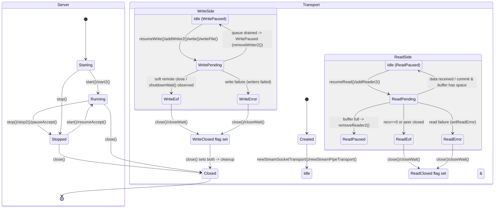
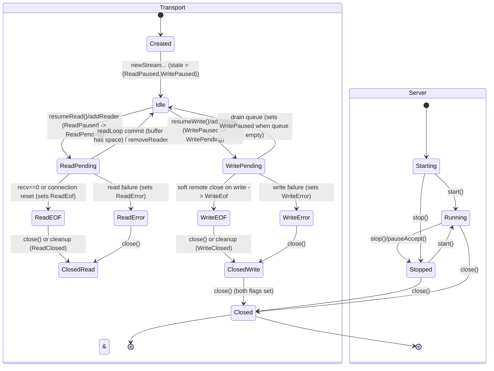

**Transport Lifecycle (Chronos stream transport)**

This document shows a detailed state transition diagram (Mermaid) for the
`StreamServer` and `StreamTransport` lifecycle implemented in
[vendor/nim-chronos/chronos/transports/stream.nim](vendor/nim-chronos/chronos/transports/stream.nim).

**Mermaid diagram**

**Explanation & mapping to public functions**

- **Created → Idle**: transport objects are allocated by `newStreamSocketTransport` / `newStreamPipeTransport` (initial `state = {ReadPaused, WritePaused}`).
- **Idle → ReadPending**: `resumeRead()` (or the internal `addReader2`) begins asynchronous reads; on POSIX this is a registered reader callback, on Windows it uses overlapped IO and sets `ReadPending`.
- **ReadPending → Idle/ReadPaused**: when data is committed and buffer still has space the loop leaves `ReadPending` and may re-arm or pause reads (calls `removeReader2` and sets `ReadPaused`).
- **ReadPending → ReadEof**: recv/read returns 0 or a connection-reset; `readStreamLoop` sets `{ReadEof, ReadPaused}`.
- **ReadPending → ReadError**: unrecoverable read error; `setReadError()` stores error object and `ReadError` is set.
- **Idle → WritePending**: `write()` / `writeFile()` enqueue vectors and call `resumeWrite()` / `addWriter2` to start `writeStreamLoop`.
- **WritePending → Idle/WritePaused**: when the write queue is drained `writeStreamLoop` sets `WritePaused` and removes the writer notification.
- **WritePending → WriteEof**: soft remote close / shutdown results (e.g., ECONNRESET/EPIPE) cause `WriteEof` and writers are completed with zero (soft EOF semantics).
- **WritePending → WriteError**: unrecoverable write error; pending writers are failed with a `TransportError`.
- **ReadEof/ReadError/ReadClosed** and **WriteEof/WriteError/WriteClosed**: each side can be closed independently; `close()` sets both `ReadClosed` and `WriteClosed` and schedules OS-level close. Use `closeWait()` / `join()` to await cleanup.

**Key public functions and the transitions they cause**

- `createStreamServer*` / `start*` / `stop*` / `close*` — server lifecycle transitions. See `start2`/`stop2`/`close` in stream.nim.
- `accept*` — when a client is accepted it creates a `StreamTransport` (Created→Idle) and schedules `server.function` callback.
- `connect*` — creates a connected `StreamTransport` (Created→Idle) for client-initiated connections.
- `write*` / `writeFile*` — enqueue write vectors and call `resumeWrite()` (IdleW→WritePending).
- `read*` / `readExactly*` / `readLine*` / `readMessage*` — use `readLoop` which depends on `readStreamLoop` to supply bytes (transitions managed internally).
- `shutdownWait*` — initiates graceful shutdown and sets `WriteEof` for the transport.
- `close*` / `closeWait*` — sets `ReadClosed` & `WriteClosed` (final resource release); continuations call `clean()`.

**Notes about concurrency / invariants**

- The implementation models read/write sides as orthogonal; many transitions are independent and can happen in any order.
- Important invariant: `resumeWrite()` on POSIX assumes that when the queue length becomes 1 the transport must be `WritePaused` (there is an assertion). If that invariant is violated a `doAssert` will trip — this is a sensitive concurrency boundary.
- The implementation attempts to handle races between `close()` and active read/write loops (checks for `ReadClosed`/`WriteClosed` in loops and completes futures); nonetheless, interleavings involving OS-level behavior can expose platform-specific races.

**Where to look in the code**

- Transport definitions and state bits: [vendor/nim-chronos/chronos/transports/common.nim](vendor/nim-chronos/chronos/transports/common.nim#L120)
- Server/accept/connect implementations: [vendor/nim-chronos/chronos/transports/stream.nim](vendor/nim-chronos/chronos/transports/stream.nim)
- Read/write loops and resume/pause semantics: search for `readStreamLoop`, `writeStreamLoop`, `resumeRead`, `resumeWrite`, `removeReader2`, `removeWriter2`.

**Next steps available**

- add the diagram into repository README or inline into `stream.nim` as comments,
- generate a variant that shows exact function names next to each transition,
- or create a small fuzz test harness that stresses `write()`/`close()`/`shutdownWait()` interleavings to try and surface the `resumeWrite()` assertion.

---

Generated on: 2025-12-28
**Mermaid state diagram (server + transport lifecycle)**

Manual (Markdown)
- **Files inspected:** stream.nim
- **Overview:** Chronos `StreamTransport` tracks I/O as sets of flags (ReadPending / ReadPaused / ReadEof / ReadError / ReadClosed and WritePending / WritePaused / WriteEof / WriteError / WriteClosed). The code treats the lifecycle as two orthogonal flows (read side and write side) that can independently progress to EOF/error/closed; `close()` marks both sides closed and releases resources.
- **States (collapsed view used in diagram):**
  - Created — object allocated by `newStreamSocketTransport` / `newStreamPipeTransport`.
  - Idle — initial running state with both read/write paused ({ReadPaused, WritePaused}).
  - ReadPending — an asynchronous read is outstanding (Windows: ReadPending vs non-Windows via registered reader).
  - ReadEOF — peer closed read side (recv returned 0 or pipe disconnected).
  - ReadError — read failed (setReadError stores TransportError).
  - WritePending — an asynchronous write is in progress / socket is registered for writing.
  - WriteEOF — graceful shutdown or remote disconnect observed on writes (shutdown or connection reset).
  - WriteError — write failed (writers are failed with TransportError).
  - Closed (ReadClosed + WriteClosed) — `close()` has been called and cleanup will be scheduled; resources completed.
- **Key public functions that drive transitions:**
  - Server: `createStreamServer*`, `start*` / `start2*` (Starting→Running), `stop*` / `stop2*` (Running→Stopped), `accept*` (spawns a `StreamTransport` on successful accept), `close*`/`closeWait*` (Stopped/Starting→Closed).
  - Transport: `newStreamSocketTransport` / `fromPipe*` (Created→Idle), `resumeRead` / `addReader2` (Idle→ReadPending), `readLoop`/`readStreamLoop` (ReadPending→Idle / ReadEOF / ReadError), `resumeWrite` / `addWriter2` (Idle→WritePending), `writeStreamLoop` (WritePending→Idle / WriteEOF / WriteError), `shutdownWait` (sets WriteEof), `close` / `closeWait` (sets ReadClosed & WriteClosed → cleanup).
  - High-level helpers: `connect*` produces a connected `StreamTransport`; `write*` and `writeFile*` enqueue write vectors and call `resumeWrite()`; `read*`/`readExactly*` use `readLoop` which waits for reader futures.
- **Observed invariants enforced in code:**
  - New transports initialize as `{ReadPaused, WritePaused}`.
  - `resumeWrite` asserts/assumes that when queue.len() == 1 the transport is `WritePaused` and switches to writing; `writeStreamLoop` will set `WritePaused` again when queue drained.
  - `resumeRead` only acts if `ReadPaused` in state (excl ReadPaused then start read loop).
  - Public write/read functions call templates `checkClosed` and `checkWriteEof` to reject operations on fully closed or write-EOF transports.
  - `close()` sets both ReadClosed & WriteClosed and schedules OS-level close; continuations call `clean()` which completes GC/refcounting.

Code check: potential inconsistencies / race observations
- resumeWrite assertion: `resumeWrite()` (POSIX branch) contains:
  - if queue.len() == 1: doAssert(WritePaused in transp.state)
  - then `addWriter2` and `transp.state.excl(WritePaused)`
  - This relies on `writeStreamLoop` always setting `WritePaused` before removing the writer registration. In practice `writeStreamLoop` sets `WritePaused` and calls `removeWriter2(transp.fd)` when the queue empties. If a race causes `resumeWrite()` to be called while `writeStreamLoop` is in the middle of emptying the queue (rare), the assert could fail. The code assumes strict ordering: writer removed only when `WritePaused` set. I found no code path that breaks that invariant, but it's a sensitive race boundary (use of `doAssert` is defensive).
- readLoop vs close: many branches set `ReadPaused` then call `completeReader()` or `removeReader2`. `close()` sets `ReadClosed` and then calls OS close. If `readStreamLoop` is running concurrently it checks `ReadClosed in transp.state` and schedules `clean()`. This ordering is consistent, but as with any async system there is a small window where `readStreamLoop` may re-arm readers after `close()` unless OS-level calls reliably interrupt. The implementation tries to handle that (e.g., `ReadClosed` checks in loops), and I found no direct obvious state corruption.
- Use-after-close prevention: public writers check `checkClosed` which fails fast. However, there are internal paths that may attempt to write after `WriteClosed` set (e.g., in Windows write loop top checks `WriteClosed` and completes pending writers with `TransportUseClosedError`). That handling seems consistent.
- Windows vs POSIX differences: both code paths attempt to maintain the same invariants, but specifics differ (OVERLAPPED vs epoll-like add/remove reader/writer). I did not find explicit mismatches, but concurrency semantics differ and subtle platform-specific races are possible (no obvious bugs found in the static scan).
- One minor note: `resumeRead`/`resumeWrite` on Windows call the low-level loop functions directly (no error return expected) while non-Windows versions register callbacks. The comments mention resumeRead() could not return any error in some places — the code accounts for that. No invalid state assignments were found (e.g., no code sets ReadClosed without later cleaning/closing).

Recommendations / guarded spots to watch in runtime
- The assertion in `resumeWrite` (POSIX) is a sensitive invariant — if you hit that assert in tests, investigate concurrent write/removeWriter ordering. Consider making it a recoverable error in production builds (or ensure writer registration/deregistration ordering with a lock or atomic flag).
- Thorough concurrency testing on both Windows and POSIX paths (interleaving `close()`, `shutdownWait()`, and concurrent `write()` / read operations) is recommended; static analysis finds no concrete invalid transition but async race windows can produce surprising behavior.
